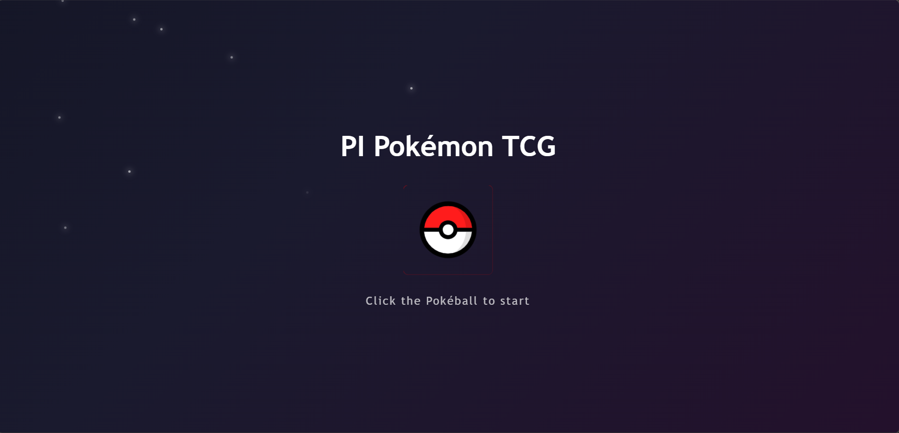
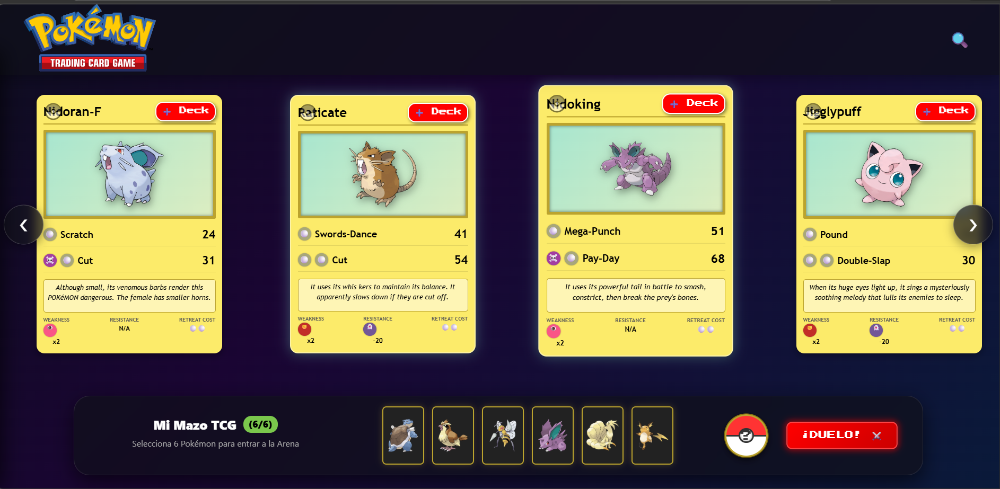
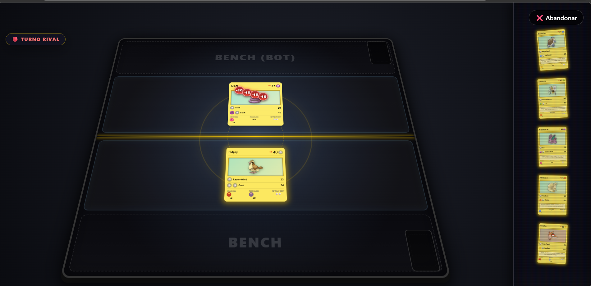
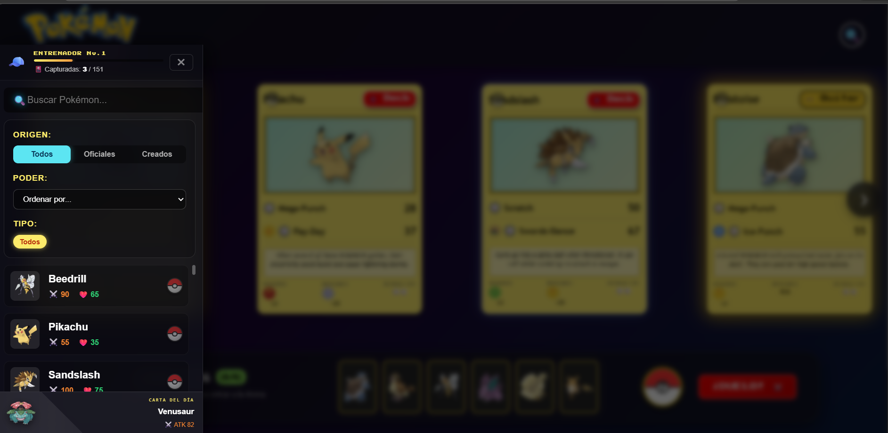

# 🚀 TCG Pokémon Arena: Vitrina de Patrones de Diseño Frontend

> Una **Aplicación de Alto Rendimiento** diseñada para demostrar arquitectura escalable, mecánicas inmersivas y excelencia visual en el ecosistema React moderno.

<p align="center">
  
</p>

<p align="center">
  
</p>


---

## 🚀 Despliegue (Live Demo)

Puedes ver la aplicación funcionando aquí: [https://tcg-arena-pokedex.vercel.app/]

> **⚠️ Nota sobre el rendimiento:** > El backend de este proyecto está alojado en un plan gratuito de **Render/Railway**. 
> Debido a las políticas de "suspensión por inactividad", el servidor puede tardar entre **30 y 50 segundos** en responder tras la primera carga. 
> ¡Gracias por tu paciencia mientras el Centro Pokémon despierta! ⚡

---

## ⚔️ Duel Arena: El Motor de Combate (Highlight Principal)

<p align="center">
  
</p>

El corazón de la aplicación es su simulador de batallas inspirado en RPGs tácticos y TCGs, con un tablero dividido en **Zona Activa, Banca y Cementerio**.

- **Game Loop mediante Máquina de Estados (FSM):** Gestión determinista de turnos (*Player Phase* / *Enemy Phase*) garantizando un flujo de combate robusto y sin *race conditions*.
- **IA Táctica con Alta Rejugabilidad:** El Engine PVE genera dinámicamente mazos aleatorios de 6 cartas para el "Rival". El Bot evalúa su mano y toma decisiones automáticas en tiempo real sobre cuándo invocar y cuándo atacar.
- **Micro-interacciones y VFX:** Implementación de *Screen Shake* en golpes críticos, animaciones de impacto, y pantallas de explosión al ser derrotada una carta.
- **Mapeo Dinámico de Ataques RPG:** Extracción y transformación de *stats* base (Attack, HP, Speed) desde la metadata original para calcular daño. Transformamos un endpoint pasivo en un motor de juego vibrante.

---

## 🛠️ Architecture Insights: El "Exorcismo" de Redux

Para maximizar el rendimiento del Game Loop y la agilidad de desarrollo, se ejecutó una refactorización arquitectónica profunda: **la migración total de Redux y Redux-Thunk hacia Zustand**.

- **Zero Boilerplate:** Sustitución de *reducers*, *actions* y *dispatchers* verbosos por hooks reactivos, limpios y precisos (`useGameStore` y `useDeckStore`).
- **Persistencia Nativa:** El mazo del jugador (Deck) se mantiene intacto entre recargas gracias a la integración del middleware `persist` de Zustand ligado al `localStorage`.
- **Rendimiento Optimizado para Gaming:** Zustand permite suscribir componentes directamente a selectores específicos, anulando re-renders globales innecesarios durante la vertiginosa cascada de interacciones en la Arena.

---

## ✨ High-Fidelity UX/UI & Features

<p align="center">
  
</p>

- **Glassmorphism & Vanilla CSS:** Arquitectura UI 100% customizada sin depender de frameworks como Bootstrap o Tailwind. Uso avanzado de transparencias, `backdrop-filter`, bordes interactivos y sombras difuminadas para emular auras mágicas.
- **Carrusel Infinito (Infinite Scroll):** Paginación numérica estática erradicada. Implementación fluida usando `Intersection Observer` y estado acumulativo para un deslizamiento horizontal ininterrumpido.
- **Pokédex OS (Dashboard Premium):** Navegación persistente empotrada en un *sidebar* con filtros multicapa (origen, tipo, rango de poder) y búsqueda *fuzzy search*, separando elegantemente los controles globales de la Arena.
- **Hologramas 3D Premium:** Integración de `react-parallax-tilt` para emular el brillo cromático (Holo foil) y la profundidad espacial de las cartas reales raras, accesible incluso en medio del combate.
- **Creación Custom (CRUD):** Capacidad de forjar Pokémon personalizados (stats e imagen) guardados directamente en la base de datos local.

---

## 🛡️ Robustez y Resiliencia

Diseñado bajo la firme filosofía de nunca fallar de forma silenciosa.

- **Error Boundary Interceptor en Zustand:** Intercepción global a nivel Store de fallas de red de la API, mitigando de raíz el mortal *"White Screen of Death"* (WSOD).
- **Fallback UI & Retry Async:** Si la red se desploma, el ecosistema despliega un Overlay cinemático, interrumpiendo elegantemente la falla y proveyendo un botón de recuperación (*Reintento de Conexión*).

---

## 🚀 Roadmap Evolutivo

✅ **Características Clave (Completadas):** - Combate PVE Integral (Duel Arena) con FSM.
- Oponente automatizado con IA básica.
- Interfaz Premium con Glassmorphism y Carrusel Infinito.
- Persistencia de datos local (Mazo de 6 slots).

🔮 **Próximos Pasos (En Desarrollo):**
- 👤 **Sistema de Autenticación:** Integración de usuarios vía JWT o OAuth para proteger mazos y creaciones.
- 🌐 **Modo PvP en Tiempo Real:** Migración del combate a un entorno multijugador utilizando WebSockets (Socket.io).
- 📈 **Sistema de Progresión (RPG):** Implementación de Puntos de Experiencia (EXP) e historial de partidas con ranking global.
- 🎇 **VFX y SFX Avanzados:** Generación geométrica de impactos (física Canvas), sonidos metálicos al impacto, y música dinámica usando el hook preparado `useGameAudio`.

---

## ⚙️ Instalación y Despliegue Local

Sigue estos pasos para clonar el proyecto, inicializar la base de datos y correr el frontend.

### 1. Clonar el repositorio
```bash
git clone [https://github.com/tu-usuario/pi-pokemon.git](https://github.com/tu-usuario/pi-pokemon.git)
cd pi-pokemon